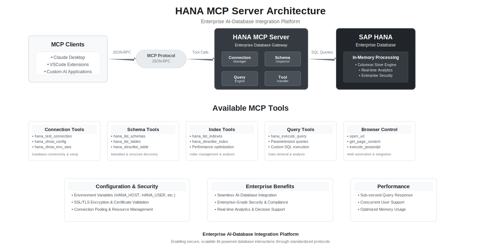

# SAP HANA MCP Server

[](https://nodejs.org/)
[](LICENSE)
[](https://modelcontextprotocol.io/)

> **Model Context Protocol (MCP) server for seamless SAP HANA database integration with AI agents and development tools.**

## 📋 Table of Contents

- [Overview](#overview)
- [Key Features](#key-features)
- [Architecture](#architecture)
- [Prerequisites](#prerequisites)
- [Installation](#installation)
- [Configuration](#configuration)
- [Usage](#usage)
- [API Reference](#api-reference)
- [Testing](#testing)
- [Development](#development)
- [Troubleshooting](#troubleshooting)
- [Contributing](#contributing)
- [License](#license)

## 🎯 Overview

The SAP HANA MCP Server provides a robust, production-ready bridge between AI applications and SAP HANA databases through the Model Context Protocol (MCP). Designed for enterprise environments, it offers comprehensive database management capabilities with secure, scalable architecture.

### Supported Platforms
- **AI Agents**: Custom AI Applications, Claude Desktop, VSCode Extensions 
- **Databases**: SAP HANA (All versions)
- **Operating Systems**: macOS, Linux, Windows
- **Node.js**: 18.x and above

## ✨ Key Features

### 🔐 Enterprise Security
- **Secure Credential Management**: Environment-based configuration
- **SSL/TLS Support**: Full encryption for database communications
- **Certificate Validation**: Configurable certificate verification

### 🗄️ Database Operations
- **Schema Exploration**: Complete database schema discovery and navigation
- **Query Execution**: Advanced SQL query execution with parameterized support
- **Administrative Tools**: System monitoring, user management, and performance insights
- **Data Management**: Sample data retrieval, row counting, and metadata analysis

### 🏗️ Architecture Excellence
- **Modular Design**: Clean separation of concerns with maintainable codebase
- **Scalable Architecture**: Easy extension and customization for enterprise needs
- **Comprehensive Logging**: Structured logging with configurable levels
- **Error Handling**: Robust error management with detailed diagnostics

### 🔧 Developer Experience
- **MCP Protocol Compliance**: Full Model Context Protocol 2.0 implementation
- **Tool Discovery**: Automatic tool registration and discovery
- **JSON-RPC 2.0**: Standardized communication protocol
- **Testing Framework**: Comprehensive testing suite with multiple validation methods

## 🏗️ Architecture

### System Architecture



### Component Architecture

```
hana-mcp-server/
├── 📁 src/
│   ├── 🏗️ server/           # MCP Protocol & Server Management
│   │   ├── index.js         # Main server entry point
│   │   ├── mcp-handler.js   # JSON-RPC 2.0 implementation
│   │   └── lifecycle-manager.js # Server lifecycle management
│   ├── 🛠️ tools/            # Tool Implementations
│   │   ├── index.js         # Tool registry & discovery
│   │   ├── config-tools.js  # Configuration management
│   │   ├── schema-tools.js  # Schema exploration
│   │   ├── table-tools.js   # Table operations
│   │   ├── index-tools.js   # Index management
│   │   └── query-tools.js   # Query execution
│   ├── 🗄️ database/         # Database Layer
│   │   ├── hana-client.js   # HANA client wrapper
│   │   ├── connection-manager.js # Connection management
│   │   └── query-executor.js # Query execution utilities
│   ├── 🔧 utils/            # Shared Utilities
│   │   ├── logger.js        # Structured logging
│   │   ├── config.js        # Configuration management
│   │   ├── validators.js    # Input validation
│   │   └── formatters.js    # Response formatting
│   └── 📋 constants/        # Constants & Definitions
│       ├── mcp-constants.js # MCP protocol constants
│       └── tool-definitions.js # Tool schemas
├── 🧪 tests/                # Testing Framework
├── 📚 docs/                 # Documentation
├── 📦 package.json          # Dependencies & Scripts
└── 🚀 hana-mcp-server.js    # Main entry point
```

## 📋 Prerequisites

### System Requirements
- **Node.js**: Version 18.x or higher
- **Memory**: Minimum 512MB RAM (2GB recommended)
- **Storage**: 100MB available disk space
- **Network**: Access to SAP HANA database

### Database Requirements
- **SAP HANA**: Version 2.0 or higher
- **User Permissions**: SELECT, DESCRIBE, and administrative privileges
- **Network Access**: TCP/IP connectivity to HANA instance

### Development Tools
- **Claude Desktop**: For AI agent integration
- **VSCode**: For development and testing (optional)
- **Git**: For version control

## 🚀 Installation

### Quick Installation

```bash
# Clone the repository
git clone <repository-url>
cd hana-mcp-server

# Install dependencies
npm install

# Make server executable
chmod +x hana-mcp-server.js

# Start the server
node hana-mcp-server.js
```

## ⚙️ Configuration

### Environment Configuration

Create a `.env` file or set environment variables:

```bash
# Required: Database Connection
HANA_HOST=your-hana-host.com
HANA_PORT=443
HANA_USER=your-username
HANA_PASSWORD=your-password
HANA_SCHEMA=your-default-schema

# Optional: Security & Performance
HANA_SSL=true
HANA_ENCRYPT=true
HANA_VALIDATE_CERT=true

# Optional: Logging Configuration
LOG_LEVEL=info
ENABLE_FILE_LOGGING=true
ENABLE_CONSOLE_LOGGING=false
```

### Claude Desktop Configuration

Configure Claude Desktop for MCP integration:

```json
{
  "mcpServers": {
    "SAP HANA Database": {
      "command": "/usr/local/bin/node",
      "args": [
        "/path/to/hana-mcp-server/hana-mcp-server.js"
      ],
      "env": {
        "HANA_HOST": "your-hana-host.com",
        "HANA_PORT": "443",
        "HANA_USER": "your-username",
        "HANA_PASSWORD": "your-password",
        "HANA_SCHEMA": "your-schema",
        "HANA_SSL": "true",
        "LOG_LEVEL": "info",
        "ENABLE_FILE_LOGGING": "true"
      }
    }
  }
}
```

**Configuration File Location:**
- **macOS**: `~/.config/claude/claude_desktop_config.json`
- **Linux**: `~/.config/claude/claude_desktop_config.json`
- **Windows**: `%APPDATA%\claude\claude_desktop_config.json`

## 🚀 Usage

### Quick Start

1. **Configure Database Connection**
   ```bash
   export HANA_HOST="your-hana-host.com"
   export HANA_USER="your-username"
   export HANA_PASSWORD="your-password"
   ```

2. **Start Server**
   ```bash
   node hana-mcp-server.js
   ```

3. **Test Connection**
   Use the `hana_test_connection` tool through Claude Desktop or MCP Inspector

### Default Schema Behavior

The server intelligently handles schema selection:

| Scenario | Behavior |
|----------|----------|
| `HANA_SCHEMA` set | Uses default schema for optional parameters |
| `HANA_SCHEMA` not set | Requires explicit schema specification |
| Schema parameter provided | Overrides default schema |

**Examples:**
```json
// With HANA_SCHEMA="MY_SCHEMA"
{"name":"hana_list_tables","arguments":{}}  // Uses MY_SCHEMA

// Override default schema
{"name":"hana_list_tables","arguments":{"schema_name":"CUSTOM_SCHEMA"}}

// Without HANA_SCHEMA (requires explicit schema)
{"name":"hana_list_tables","arguments":{"schema_name":"MY_SCHEMA"}}
```

## 📚 API Reference

### Configuration Tools

| Tool | Description | Parameters |
|------|-------------|------------|
| `hana_show_config` | Display current HANA configuration | None |
| `hana_test_connection` | Test database connectivity | None |
| `hana_show_env_vars` | Show environment variables (debug) | None |

### Schema Exploration Tools

| Tool | Description | Parameters |
|------|-------------|------------|
| `hana_list_schemas` | List all database schemas | None |
| `hana_list_tables` | List tables in a schema | `schema_name` (optional) |
| `hana_describe_table` | Show table structure | `schema_name`, `table_name` |
| `hana_list_indexes` | List indexes for a table | `schema_name`, `table_name` |
| `hana_describe_index` | Show index details | `schema_name`, `table_name`, `index_name` |

### Query Execution Tools

| Tool | Description | Parameters |
|------|-------------|------------|
| `hana_execute_query` | Execute SQL queries | `query` |
| `hana_execute_parameterized_query` | Execute parameterized queries | `query`, `parameters` |
| `hana_get_sample_data` | Get sample data from table | `schema_name`, `table_name`, `limit` |
| `hana_count_rows` | Count rows in a table | `schema_name`, `table_name` |

### Administrative Tools

| Tool | Description | Parameters |
|------|-------------|------------|
| `hana_get_system_info` | Get system information | None |
| `hana_get_user_info` | Get current user information | None |
| `hana_get_memory_usage` | Get memory usage statistics | None |

### Tool Response Format

All tools return standardized JSON responses:

```json
{
  "content": [
    {
      "type": "text",
      "text": "Tool execution result"
    }
  ],
  "isError": false,
  "error": null
}
```

## 🧪 Testing

### Testing Framework Overview

The project includes a comprehensive testing suite with multiple validation methods:

```
tests/
├── 🧪 automated/           # Automated test suite
├── 🖱️ manual/             # Manual testing tools
├── 🔍 mcpInspector/       # MCP Inspector configuration
└── 📋 README.md           # Testing documentation
```

### 1. MCP Inspector Testing (Recommended)

**Web-based interactive testing interface:**

```bash
# Open MCP Inspector
open https://modelcontextprotocol.io/inspector

# Use configuration from tests/mcpInspector/mcp-inspector-config.json
```

**Benefits:**
- Visual tool discovery and testing
- Real-time request/response inspection
- Protocol compliance validation
- Interactive debugging capabilities

### 2. Automated Testing

**Run comprehensive test suite:**

```bash
# Navigate to test directory
cd tests/automated

# Run automated tests
node test-mcp-inspector.js

# Run with specific configuration
HANA_HOST="test" HANA_USER="test" node test-mcp-inspector.js
```

### 3. Manual Testing

**Interactive command-line testing:**

```bash
# Navigate to manual test directory
cd tests/manual

# Start interactive testing
node manual-test.js
```

### 4. Quick Validation Tests

**Test server functionality manually:**

```bash
# Test initialization
echo '{"jsonrpc":"2.0","id":1,"method":"initialize","params":{"protocolVersion":"2024-11-05","capabilities":{},"clientInfo":{"name":"test","version":"1.0"}}}' | node hana-mcp-server.js

# Test tools listing
echo '{"jsonrpc":"2.0","id":2,"method":"tools/list","params":{}}' | node hana-mcp-server.js

# Test tool execution
HANA_HOST="test" HANA_USER="test" HANA_PASSWORD="test" echo '{"jsonrpc":"2.0","id":3,"method":"tools/call","params":{"name":"hana_show_config","arguments":{}}}' | node hana-mcp-server.js
```

### Integration Testing

1. **Configure Claude Desktop** with MCP server settings
2. **Restart Claude Desktop** to load new configuration
3. **Test connection** using AI agent commands
4. **Verify tool functionality** through natural language interaction

## 🔧 Development

### Development Setup

```bash
# Clone repository
git clone <repository-url>
cd hana-mcp-server

# Install development dependencies
npm install

# Start development server with auto-reload
npm run dev
```

### Adding New Tools

#### 1. Create Tool Implementation

```javascript
// src/tools/my-tools.js
const { logger } = require('../utils/logger');
const Formatters = require('../utils/formatters');

class MyTools {
  static async myNewTool(args) {
    logger.tool('my_new_tool', args);
    
    try {
      // Tool implementation
      const result = await this.performOperation(args);
      
      return Formatters.createResponse(result);
    } catch (error) {
      logger.error('Tool execution failed', error);
      return Formatters.createErrorResponse(error.message);
    }
  }
  
  static async performOperation(args) {
    // Tool logic implementation
    return "Operation completed successfully";
  }
}

module.exports = MyTools;
```

#### 2. Register Tool

```javascript
// src/tools/index.js
const MyTools = require('./my-tools');

const TOOL_IMPLEMENTATIONS = {
  // ... existing tools
  my_new_tool: MyTools.myNewTool
};
```

#### 3. Define Tool Schema

```javascript
// src/constants/tool-definitions.js
{
  name: "my_new_tool",
  description: "Performs a specific operation with detailed description",
  inputSchema: {
    type: "object",
    properties: {
      parameter1: {
        type: "string",
        description: "Description of parameter1"
      },
      parameter2: {
        type: "number",
        description: "Description of parameter2"
      }
    },
    required: ["parameter1"]
  }
}
```

#### 4. Test Implementation

```bash
# Test new tool using MCP Inspector
# Or run manual tests
cd tests/manual
node manual-test.js
```

### Development Scripts

```json
{
  "scripts": {
    "start": "node hana-mcp-server.js",
    "dev": "nodemon hana-mcp-server.js"
  }
}
```

## 🐛 Troubleshooting

### Common Issues & Solutions

#### Connection Issues

| Issue | Cause | Solution |
|-------|-------|----------|
| "Connection refused" | Network connectivity | Verify HANA host and port accessibility |
| "Authentication failed" | Invalid credentials | Check username/password in configuration |
| "SSL certificate error" | Certificate validation | Configure `HANA_VALIDATE_CERT=false` or install valid certificates |

#### MCP Protocol Issues

| Issue | Cause | Solution |
|-------|-------|----------|
| "MCP server not visible" | Configuration path | Verify Claude Desktop config file location |
| "Tools disabled" | Protocol compliance | Check JSON-RPC implementation and tool structure |
| "Handler is not a function" | Tool registration | Verify tool implementation and registration |

### Debugging

#### Enable Debug Logging

```bash
# Set debug logging
export LOG_LEVEL="debug"
export ENABLE_FILE_LOGGING="true"
export ENABLE_CONSOLE_LOGGING="true"

# Monitor logs
tail -f hana-mcp-server.log
```

#### Manual Server Testing

```bash
# Test with minimal configuration
HANA_HOST="test" HANA_USER="test" HANA_PASSWORD="test" node hana-mcp-server.js

# Test specific functionality
echo '{"jsonrpc":"2.0","id":1,"method":"tools/call","params":{"name":"hana_test_connection","arguments":{}}}' | node hana-mcp-server.js
```

### Error Codes

The server uses standard JSON-RPC 2.0 error codes:

| Code | Description | Action |
|------|-------------|--------|
| `-32700` | Parse error | Check JSON format |
| `-32600` | Invalid request | Verify request structure |
| `-32601` | Method not found | Check method name |
| `-32602` | Invalid params | Verify parameter format |
| `-32603` | Internal error | Check server logs |

## 🤝 Contributing

We welcome contributions from the community! Please follow these guidelines:

### Contribution Process

1. **Fork the repository**
2. **Create a feature branch**: `git checkout -b feature/amazing-feature`
3. **Make your changes** following coding standards
4. **Add tests** for new functionality
5. **Update documentation** as needed
6. **Test thoroughly** using MCP Inspector
7. **Submit a pull request** with detailed description

### Development Guidelines

- **Code Style**: Follow existing code patterns
- **Testing**: Test new features with MCP Inspector
- **Documentation**: Update README and inline documentation
- **Security**: Follow security best practices for database operations
- **Performance**: Consider performance implications of changes

### Pull Request Template

```markdown
## Description
Brief description of changes

## Type of Change
- [ ] Bug fix
- [ ] New feature
- [ ] Documentation update
- [ ] Performance improvement

## Testing
- [ ] MCP Inspector tests pass
- [ ] Manual testing completed
- [ ] No breaking changes

## Checklist
- [ ] Code follows existing patterns
- [ ] Self-review completed
- [ ] Documentation updated
- [ ] No breaking changes
```

## 📄 License

This project is licensed under the **MIT License** - see the [LICENSE](LICENSE) file for details.

### License Summary

- **Commercial Use**: ✅ Allowed
- **Modification**: ✅ Allowed
- **Distribution**: ✅ Allowed
- **Private Use**: ✅ Allowed
- **Liability**: ❌ No liability
- **Warranty**: ❌ No warranty

## 🙏 Acknowledgments

- **SAP** for HANA database technology and support
- **Anthropic** for Claude Desktop and MCP specification
- **MCP Community** for protocol development and standards
- **Open Source Contributors** for valuable feedback and contributions
