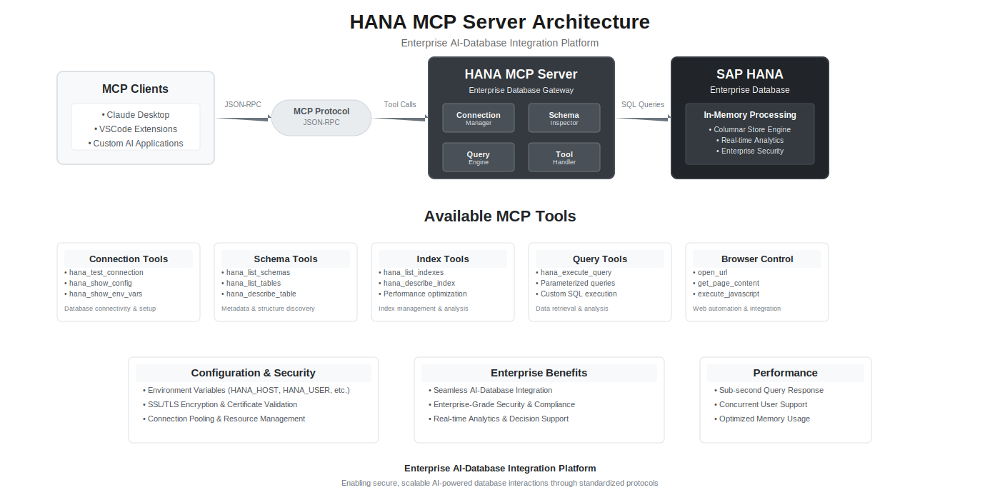

# HANA MCP Server

[](https://www.npmjs.com/package/hana-mcp-server)
[](https://www.npmjs.com/package/hana-mcp-server)
[](https://nodejs.org/)
[](LICENSE)
[](https://modelcontextprotocol.io/)

> **Model Context Protocol (MCP) server for SAP HANA: connect AI assistants and development tools to your database.**

## 🎯 Use cases

| Use case | Transport | Go to |
|----------|-----------|--------|
| **Claude Desktop** — Chat over HANA data | stdio | [Claude Desktop](#-claude-desktop) |
| **IDEs** — Claude Code, VS Code, Cline, Cursor, Windsurf | stdio | [IDEs & code agents](#-ides--code-agents) |
| **Hosted / apps** — Run server for multiple clients or your app | HTTP | [Hosted & HTTP](#-hosted--http) |

Install from npm (`npm install -g hana-mcp-server`) or use npx in your client config; no global install required for IDEs or HTTP.

---

## 🖥️ Claude Desktop

1. Edit your Claude Desktop config file:
   - **macOS**: `~/Library/Application Support/Claude/claude_desktop_config.json`
   - **Windows**: `%APPDATA%\claude\claude_desktop_config.json`
   - **Linux**: `~/.config/claude/claude_desktop_config.json`

2. Add the MCP server (use the same [configuration](#configuration) env vars as needed):

```json
{
  "mcpServers": {
    "HANA Database": {
      "command": "hana-mcp-server",
      "env": {
        "HANA_HOST": "your-hana-host.com",
        "HANA_PORT": "443",
        "HANA_USER": "your-username",
        "HANA_PASSWORD": "your-password",
        "HANA_SCHEMA": "your-schema",
        "HANA_SSL": "true",
        "HANA_ENCRYPT": "true",
        "HANA_VALIDATE_CERT": "true",
        "HANA_CONNECTION_TYPE": "auto",
        "HANA_INSTANCE_NUMBER": "10",
        "HANA_DATABASE_NAME": "HQQ",
        "LOG_LEVEL": "info",
        "ENABLE_FILE_LOGGING": "true",
        "ENABLE_CONSOLE_LOGGING": "false"
      }
    }
  }
}
```

3. Restart Claude Desktop.

For a UI to manage configs and deploy to Claude Desktop: [HANA MCP UI](https://www.npmjs.com/package/hana-mcp-ui) (`npx hana-mcp-ui`).

---

## 💻 IDEs & code agents

Use stdio; same [configuration](#configuration) env vars as above. One canonical example (Claude Code):

Add to **`~/.claude.json`** (global) or **`.mcp.json`** (project root):

```json
{
  "mcpServers": {
    "hana": {
      "type": "stdio",
      "timeout": 600,
      "command": "npx",
      "args": ["-y", "hana-mcp-server"],
      "env": {
        "HANA_HOST": "<host>",
        "HANA_PORT": "31013",
        "HANA_USER": "<user>",
        "HANA_PASSWORD": "<password>",
        "HANA_SCHEMA": "SAPABAP1",
        "HANA_DATABASE_NAME": "HQQ",
        "HANA_SSL": "false",
        "HANA_ENCRYPT": "false",
        "HANA_VALIDATE_CERT": "false",
        "LOG_LEVEL": "info",
        "ENABLE_FILE_LOGGING": "true",
        "ENABLE_CONSOLE_LOGGING": "false"
      }
    }
  }
}
```

Same pattern for VS Code, Cline, Cursor, and Windsurf—add this server to your IDE’s MCP list with the same `command` / `args` / `env`. For MDC tenants set `HANA_DATABASE_NAME` (e.g. `HQQ`). Restart MCP after config changes.

---

## 🌐 Hosted & HTTP

For HTTP (remote or multi-client), start the server:

```bash
npm run start:http
```

Default: `http://127.0.0.1:3100/mcp`. Override with `MCP_HTTP_PORT` and optionally `MCP_HTTP_HOST`. Send JSON-RPC via POST to `/mcp`; include `MCP-Protocol-Version: 2025-11-25` (or a supported version) if your client supports it.

For production: run behind a reverse proxy with authentication and bind to localhost unless you need remote access.

---

## 🛠️ Configuration

Set the same environment variables in your client or server env. Full reference:

### Required

| Parameter | Description | Example |
|-----------|-------------|---------|
| `HANA_HOST` | Database hostname or IP | `hana.company.com` |
| `HANA_USER` | Database username | `DBADMIN` |
| `HANA_PASSWORD` | Database password | — |

### Optional

| Parameter | Description | Default | Options |
|-----------|-------------|---------|---------|
| `HANA_PORT` | Database port | `443` | Any valid port |
| `HANA_SCHEMA` | Default schema | — | Schema name |
| `HANA_CONNECTION_TYPE` | Connection type | `auto` | `auto`, `single_container`, `mdc_system`, `mdc_tenant` |
| `HANA_INSTANCE_NUMBER` | Instance number (MDC) | — | e.g. `10` |
| `HANA_DATABASE_NAME` | Database name (MDC tenant) | — | e.g. `HQQ` |
| `HANA_SSL` | Enable SSL | `true` | `true`, `false` |
| `HANA_ENCRYPT` | Enable encryption | `true` | `true`, `false` |
| `HANA_VALIDATE_CERT` | Validate SSL certificates | `true` | `true`, `false` |
| `LOG_LEVEL` | Logging level | `info` | `error`, `warn`, `info`, `debug` |
| `ENABLE_FILE_LOGGING` | File logging | `true` | `true`, `false` |
| `ENABLE_CONSOLE_LOGGING` | Console logging | `false` | `true`, `false` |

### Database connection types

#### 1. Single-container database

Standard HANA database with a single tenant.

**Required**: `HANA_HOST`, `HANA_USER`, `HANA_PASSWORD`  
**Optional**: `HANA_PORT`, `HANA_SCHEMA`

```json
{
  "HANA_HOST": "hana.company.com",
  "HANA_PORT": "443",
  "HANA_USER": "DBADMIN",
  "HANA_PASSWORD": "password",
  "HANA_SCHEMA": "SYSTEM",
  "HANA_CONNECTION_TYPE": "single_container"
}
```

#### 2. MDC system database

Multi-tenant system database (manages tenants).

**Required**: `HANA_HOST`, `HANA_PORT`, `HANA_INSTANCE_NUMBER`, `HANA_USER`, `HANA_PASSWORD`  
**Optional**: `HANA_SCHEMA`

```json
{
  "HANA_HOST": "192.168.1.100",
  "HANA_PORT": "31013",
  "HANA_INSTANCE_NUMBER": "10",
  "HANA_USER": "SYSTEM",
  "HANA_PASSWORD": "password",
  "HANA_SCHEMA": "SYSTEM",
  "HANA_CONNECTION_TYPE": "mdc_system"
}
```

#### 3. MDC tenant database

Multi-tenant tenant database (specific tenant).

**Required**: `HANA_HOST`, `HANA_PORT`, `HANA_INSTANCE_NUMBER`, `HANA_DATABASE_NAME`, `HANA_USER`, `HANA_PASSWORD`  
**Optional**: `HANA_SCHEMA`

```json
{
  "HANA_HOST": "192.168.1.100",
  "HANA_PORT": "31013",
  "HANA_INSTANCE_NUMBER": "10",
  "HANA_DATABASE_NAME": "HQQ",
  "HANA_USER": "DBADMIN",
  "HANA_PASSWORD": "password",
  "HANA_SCHEMA": "SYSTEM",
  "HANA_CONNECTION_TYPE": "mdc_tenant"
}
```

#### Auto-detection

When `HANA_CONNECTION_TYPE` is set to `auto` (default), the server infers the type:

- If `HANA_INSTANCE_NUMBER` + `HANA_DATABASE_NAME` → **MDC tenant**
- If only `HANA_INSTANCE_NUMBER` → **MDC system**
- If neither → **Single-container**

---

## 🎯 Capabilities

- **Schema exploration**: List schemas, tables, table structures.
- **Query execution**: Run SQL; sample data; system info.
- **Natural language**: e.g. “Show me all tables in the SYSTEM schema”, “Describe the structure of table CUSTOMERS”, “Get sample data from ORDERS table”.

### MCP features (spec 2025-11-25)

- **Tools**: All tools include `title` and annotations (`readOnlyHint`, `destructiveHint`, `idempotentHint`, `openWorldHint`). Query execution supports optional **task** for long-running runs.
- **Resources**: Schemas and tables under `hana:///`; `resources/list`, `resources/read`, `resources/templates/list`.
- **Tasks**: Long-running tool calls (e.g. `hana_execute_query`) can use `task: { ttl }`; poll `tasks/get` and `tasks/result`. In-memory; do not persist across restarts.

---

## 🖥️ HANA MCP UI

Web UI to configure environments, deploy to Claude Desktop, and test connectivity:

```bash
npx hana-mcp-ui
```


---

## 🔧 Troubleshooting

- **Connection refused**: Check HANA host and port.
- **Authentication failed / No client available**: Verify user/password; for MDC tenants set `HANA_DATABASE_NAME` (e.g. `HQQ`). The connection test tool returns the last HANA error when the client is unavailable.
- **SSL certificate error**: Set `HANA_VALIDATE_CERT=false` or install valid certificates.
- **MDC**: If you omit `HANA_DATABASE_NAME` for a tenant, you may see auth failures. MDC often uses SQL port (e.g. 31013); set `HANA_PORT` and `HANA_INSTANCE_NUMBER` as required.

**Debug**: `export LOG_LEVEL="debug"` and `export ENABLE_CONSOLE_LOGGING="true"`, then run the server.

---

## 🏗️ Architecture



```
hana-mcp-server/
├── src/
│   ├── server/           # MCP protocol, lifecycle, resources, HTTP transport
│   ├── tools/            # Schema, table, query, index, config tools
│   ├── database/         # HANA client, connection manager, query executor
│   ├── utils/            # Logger, config, validators, formatters
│   └── constants/        # MCP constants, tool definitions
├── tests/
├── docs/
└── hana-mcp-server.js    # Entry point
```

---

## 📦 Package info

- **Size**: 21.7 kB
- **Dependencies**: @sap/hana-client, axios
- **Node.js**: 18+
- **Platforms**: macOS, Linux, Windows

## 🤝 Support

- **Issues**: [GitHub Issues](https://github.com/hatrigt/hana-mcp-server/issues)
- **UI**: [HANA MCP UI](https://www.npmjs.com/package/hana-mcp-ui)

## 📄 License

MIT — see [LICENSE](LICENSE).